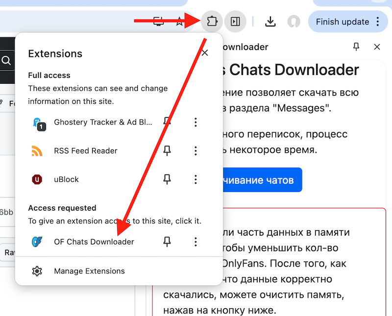

# Инструкция и детали работы

Данное расширение скачивает все диалоги с OnlyFans из-под того аккаунта, который у вас сейчас открыт. Сообщения сохраняются в урезанном виде, по минимуму.


## Установка расширения

1. Скачиванием последнюю версию расширения с [этой страницы](https://github.com/baffolobill/chrome-extension-ofchatsdownloader/releases). Имя файла начинается с "chrome-extension-". Например, [chrome-extension-ofchatsdownloader-v0.4.0.zip](https://github.com/baffolobill/chrome-extension-ofchatsdownloader/releases/download/v0.6.1/chrome-extension-ofchatsdownloader-v0.4.0.zip).
2. Извлекаем в любую папку скаченный zip-архив.
3. Открываем в Chrome ссылку: [chrome://extensions](chrome://extensions).
4. Включаем "Режим разработчика" ("Developer mode") (переключатель в верхнем правом углу).
5. Нажимаем на этой же странице кнопку "Load unpacked" (слева сверху) и выбираем папку, в которую извлекли расширение во (2) пункте.


## Шаги для скачивания чатов

1. Открываем в chrome https://onlyfans.com
2. Запускаем расширение. Для этого нажимаем кнопку "расширения" и из списка выбираем "OF Chats Downloader".  

3. Выполняем вход в нужный аккаунт onlyfans, если вы еще не вошли. А если вошли, обновите страницу и дождитесь окончания загрузки сайта.
4. Нажимаем в расширении кнопку "Начать скачивание".
5. Ждем, пока все скачаются диалоги. Они автоматически сохранятся в файл `model_{ID аккаунта}.json` на вашем компьютере в папку, в которую у вас браузер скачивает все файлы.
6. Передаем этот файл нам.

### Рекомендации

- Не стоит открывать сайт на вкладке в режиме "Инкогнито". Есть проблемы с работой расширения.
- Расширение использует относительно новую фичу "боковая панель", которая требует свежей версии браузера.
- Возможны проблемы с аккаунтами, где включена 2FA для логина в профиль. Не проверяли этот сценарий. Если есть проблемы со скачиванием, возможно поэтому. Обратитесь к нам, мы доделаем расширение.


## Обновление расширения

1. Скачиванием последнюю версию расширения с [этой страницы](https://github.com/baffolobill/chrome-extension-ofchatsdownloader/releases). Имя файла начинается с "chrome-extension-". Например, chrome-extension-ofchatsdownloader-v0.4.0.zip.
2. Дальше, важно перезаписать содержимое старой папки, новыми файлами. Речь идет о папке, выбранной в (5) пункте при установке.

Посмотреть папку можно на странице расширения. Для этого открываем страницу со списком расширений [chrome://extensions](chrome://extensions). И далее нажимаем кнопку "Details" у нашего расширения:  


В самом низу страницы будет указан путь, по которому находятся исходные файлы расширения:  


В данном случае расширение находится тут: `~/Documents/GitHub/chrome-extension-webpack-boilerplate-v2/chrome-extension-ofchatsdownloader-v0.4.0`.

Самый простой способ обновить - удалить папку `chrome-extension-ofchatsdownloader-v0.4.0` и разархивировать скаченный ранее архив на место этой папки. Если после извлечения появилась папка с именем, отличным от `chrome-extension-ofchatsdownloader-v0.4.0`, переименуйте ее.

Чтобы убедиться, что всё сделано правильно, кликните на путь, отображаемый на странице расширения (эту страницу открыли чуть ранее).  


Если у вас открылось окошко со списком файлов и там есть файл "manifest.json", значит всё сделано корректно и можно сказать браузера, чтобы он перезагрузил расширение.


Теперь, надо сказать Chrome, чтобы он перезагрузил у себя расширение. Для этого, на странице со списком расширений, нужно нажать на указанную иконку:  


### Пояснения

Почему может быть важно именно обновить, а не переустановить. Дело в том, что в случае переустановки, содержимое хранилища старой версии удалится и если чаты не докачались, процесс начнется сначала.

При обновлении же, содержимое хранилища остается. Поэтому так важно просто перезаписать старые файлы новыми и перезапустить расширение.


## Удаление расширения

1. Открываем в Chrome ссылку: [chrome://extensions](chrome://extensions).
2. Найдите там расширение с названием "OF Chats Downloader".
3. Нажимаем кнопку "Удалить" (Remove).
4. Удаляем папку с расширением (см. "Установка", пункт 2).


## Что сохраняется

Сохраняем минимум данных. Вот как выглядит дамп диалогов:

```json
{
    "ID клиента, с которым идет диалог": [
        {
            "id": "ID сообщения, чтобы смогли отсортировать их в порядке написания",
            "createdAt": "Дата сообщения, чтобы был контекст (например, диалог на 8 марта)",
            "text": "Само сообщение",
            "whoWrote": "кто написал сообщение: model - модель, client - клиент, other - кто-то другой",
            "hasMedia": "Содержит ли сообщение фото/видео/аудио (true/false). Так понятнее, почему в сообщении нет текста."
        },
        ...
    ],
    ...
}
```

Диалоги сохраняются и скачиваются в файл с именем `model_{ID аккаунта}.json`.


## Детали работы

Расширение взаимодействует только с сайтом onlyfans.com. Оно отправляет те же самые запросы, что и сам сайт onlyfans и прямиком из вашего браузера. Вы можете быть уверены в безопасности вашего аккаунта и данных.

Расширение берет все необходимые для работы данные из браузера (cookie и хранилище браузера). Ничего вводить НЕ ТРЕБУЕТСЯ и если кто-то просит предоставить дополнительные данные - это мошенники.

Выполняются следующие запросы:
- Запрос данных профиля. Выполняется можно сказать просто так. Без него иногда не проходят следующие два запроса.
- Получение списка чатов. Это нужно для получения ID аккаунта, чтобы потом сформировать ссылку на чат.
- И далее получаем список всех сообщений в каждом чате.

По окончанию скачивания, рекомендуем удалить это расширение.